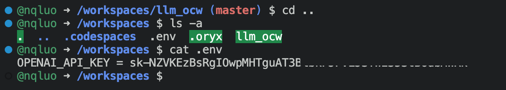

# llm_ocw
Learning LLM

## How to setup the OPENAI_API_KEY in codespace
- open the terminal
- cd to the parent directory of the respository
- add the "OPENAP_API_KEY = sk-*************************" to a .env file

## How to limit access to the codespace in public repository by set up OAuth token authentication

Here are the steps to set up OAuth token authentication:

1. Generate a personal access token on your GitHub account by going to your account settings and generating a new token with the appropriate permissions. 
GitHub Copilot: To generate a personal access token on GitHub, you can follow these steps:
Here are the steps: GitHub account settings -> "Developer settings" -> "Personal access tokens" -> "Generate new token".

2. In your Codespace, set the `GITHUB_TOKEN` environment variable to the value of the personal access token. Add the "export GITHUB_TOKEN=***********" to the end of the `~/.bashrc` file. 
The `.bashrc` file is not lost when you restart your Codespace. The `.bashrc` file is a shell script that is executed every time you start a new terminal session. It is stored in your home directory, which is persistent across restarts of your Codespace.
By adding the `export` command to your `.bashrc` file, you ensure that the `GITHUB_TOKEN` environment variable is set correctly every time you start a new terminal session in your Codespace.

## How to remove sensity information from file / history

GitHub Docs: [Removing sensitive data from a repository](https://docs.github.com/en/authentication/keeping-your-account-and-data-secure/removing-sensitive-data-from-a-repository)

Git git-filter-branch - [Rewrite branches](https://git-scm.com/docs/git-filter-branch)

TO WRITE THE HOWTO

Case 1: Sensitive information appears in the latest commit.

- Solution 1.1: Remove the latest commit that contains the sensitive information.

Case 2: Sensitive information appears in the middle of some commit.

- Solution 2.1: Remove the whole file that contains sensitive information from the entire commit history.

- Solution 2.2: Remove only the sensitive information, without affecting the entire commit history.

